# References

[Neso Acadey - Operating System](https://www.youtube.com/playlist?list=PLBlnK6fEyqRiVhbXDGLXDk_OQAeuVcp2O)

[Operating System Concepts 10th Edition Wiley](https://www.wiley.com/en-us/Operating+System+Concepts%2C+10th+Edition-p-9781119320913)

# Introduction to OS

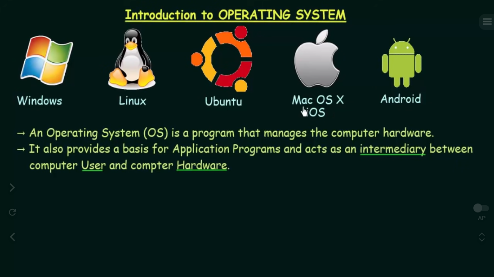  

- An OS is a program that manages the computer hardware.
- It also provides a basis for Application Programs, and acts as an ==intermediary between computer user and computer hardware.==

 

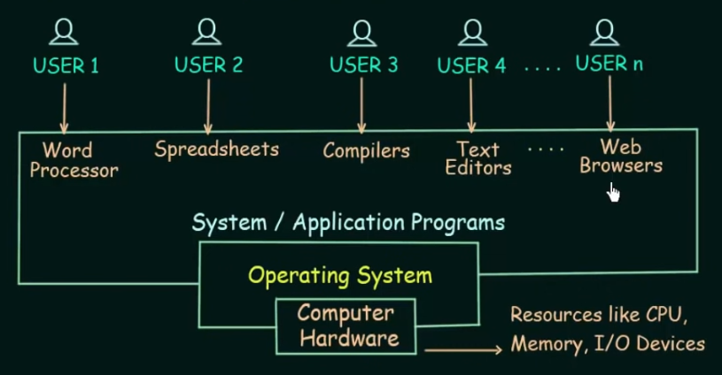 

- This diagram represents the basic structure and basic components of a computer system.
- At the lowest level, we have the **computer hardware**.
- Computer hardware consists of resources like CPU, memory, and I/O devices.

- On the top of computer hardware, we have the **OS**.
- And then on the top of the OS, we have the ==**system** or the **application programs**.==
- There are two kinds of software that we have which is System Software and Application Software.
- A **==system software==** is the software that is used to directly command or modify computer hardware.
  -  The OS is also a kind of system software.
- An **==application program==** is the programs or the software that are used to perform a specific task and that can be directly used by users.
  - ex) Karrot Market, VS Code

> 
>
> If there is no operating system, you have to write codes manually for everything you perform. It is very tedious and difficult task.
>
> 

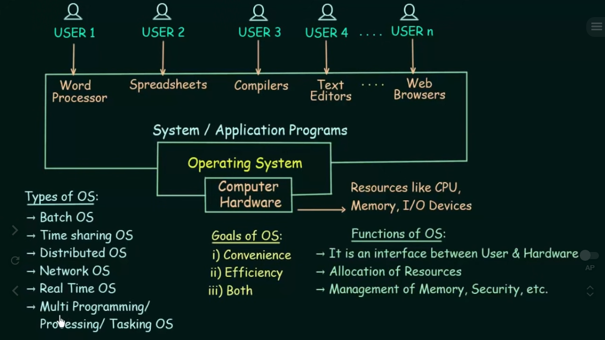 

# Computer System Operation

 

- A modern general-purpose computer system consists of one or more CPUs. 
- And a number of device controllers connected through a common bus that provides access to shared memory.
- Each device controller is in charge of a specific type of device
- ==The CPU and the device controllers can execute concurrently, competing for memory cycles.==
  - In order to work, All these devices need to be loaded into the main memory (RAM). 
- To ensure orderly access to the shared memory, a ==**memory controller**== is provided whose function is to synchronize access to the memory.

## 1. Bootstrap Program

- The initial program that runs when a computer is powered up or rebooted.
- It is sotred in the ROM.
  - ROM stands for Read Only Memory which is a kind of secondary memory.
- It must know ==how to load the OS== and start executing that system.
- OS is stored somewhere in the secondary memory. So the bootstrap program must know where your OS is stored. And it must go there and invoke the operating system. And It must load the OS kernel into your main memory.
  - Kernel is the main part of an operating system.

## 2. Interrupt, System Call & ISR

- The occurrence of an event is usually signaled by an interrupt from hardware or software
- Sometimes the hardware or software may interrupt the CPU.
- Hardware may trigger an interrupt at any time by sending a signal to the CPU, usually by the way of the system bus.

- Software can trigger an interrupt by executing a special operation called system call.

- ==When the CPU is interrupted, it stops what it is doing and immediately transfers execution to a fixed location.==
  - The fixed location usually contains the starting address where the ==__service routine__== of the interrupt is located.
  - What has to be executed or ==what the interrupts want to do is written in the service routine==.
  - So every interrupt has its service routine known as the ==interrupt service routine (ISR).==
- The Interrupt Service Routine executes.
- On completion, the CPU resumes the interrupted computation.

# Storage Structure

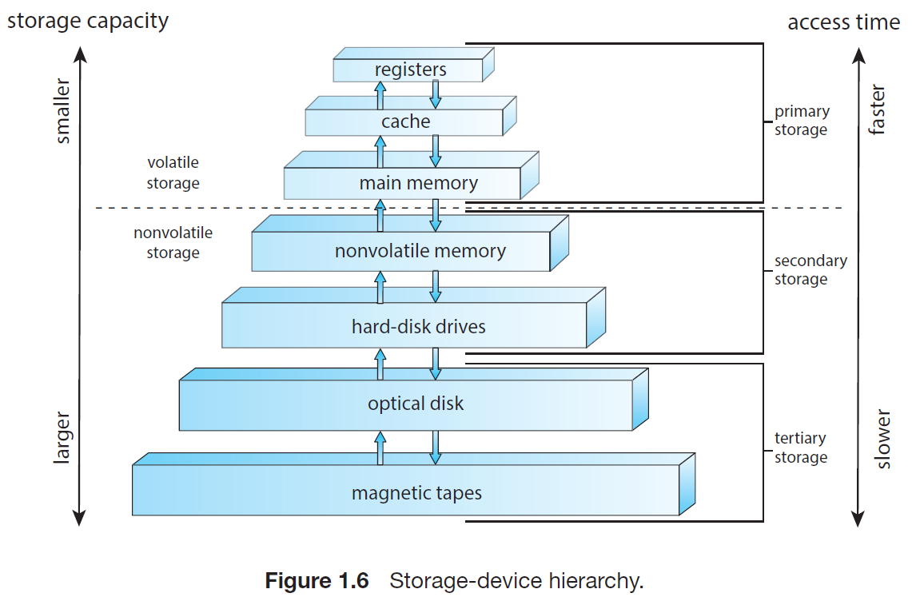 

(Wiley Operating System 10th 13p.)

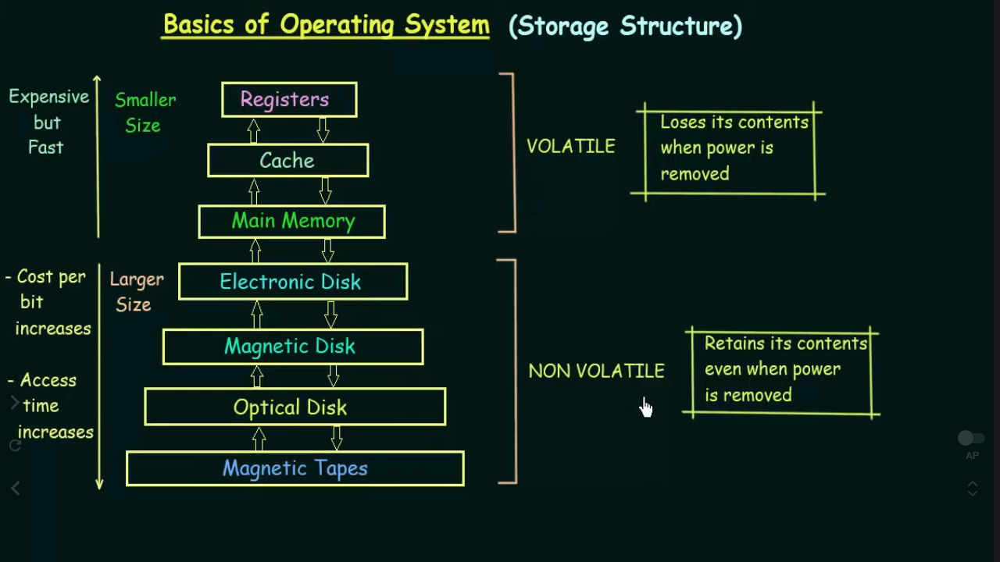

- Main Memory is a **Random Access Memory**(RAM)
- Electronic disk, magnetic disk, optical disk, magnetic tapes are a **secondary memory**.
- 

# I/O Structure

- Storage is also just one of many I/O devices within a computer.
- ==A Large portion of operating system code is dedicated to managing I/O==, because it is important to the reliability and performance of a system, and there are various devices.
- A general-purpose computer system consists of CPUs and multiple device controllers that are connected ==through a common bus== that provides access to shared memory.

-  
- Each **device controller** is in charge of a specific type of device.
  - A device controller maintains a local buffer storage and a set of special purpose registers.
- Typically, operating systems have ==a **device driver** for each **device controller**.==
- **This device driver** understands the device controller and presents a uniform interface to the device to the rest of the operating system.

## Working of an I/O Operation

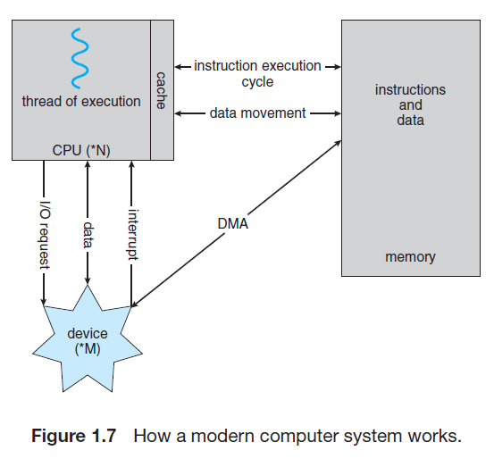 

- ==To start an I/O operation, the device driver loads **the appropriate registers** within the device controller.==
- The device controller, in turn, examines the contents of these registers to determine what action to take.
- The controller starts the transfer of data from the device to ==its local buffer==.
- Once the transfer of data is complete, the device controller informs the device driver via an interrupt that it has finished its operation.
- The device driver then returns control to the operating system.
- This form of interrupt-driven I/O is find for moving small amounts of data but can produce high overhead when used for bulk data movement.
- To solve this problem, Direct Memory Access (DMA) is used.
- After setting up buffers, pointers, and counters for the I/O device, the device controller transfers an entire block of data directly to or from its own buffer storage to memory, with no intervention by the CPU.

# Computer System Architecture

 

### 1. Single Processor System

- In the single processor system, ==**we only have one main CPU**== which is capable of executing a general purpose instruction set including instruction from ==<u>**user processes**</u>==.

- In the single processor system, apart from the main CPU, there are also ==**other special purpose processors** which don't do the general purpose task but perform some **device specific task**.==
  - This means that we have certain devices in our computer, like keyboard, hard disk, and so on. So for all this, there may be some microprocessor that is specified to do **a specific task related to that device**.
  - Let's say we have our keyboard. When you pressed a key on your keyboard, the key stroke has to be converted to some kind of code. So, in order to convert a keystroke to a code, there is a little microprocessor present on your keyboard which is going to perform only that task of converting your keystroke to some kind of code.

### 2. Multiprocessor Systems

- Also known as parallel systems or tightly coupled systems.

- Has two or more processors in close communication, sharing the computer bus and sometimes the clock, memory, and peripheral devices.

- Advantages of Multiprocessor System:

  - more throughput (**==more performance==**)
    - Throughput is used to measure the performance of our system.
    - The amount of data that can be transferred from one location to another.
  - **==more economic==** as compared to single processor system.
    - Because in the multiprocessor system, we have these different processors sharing the resources of our computers or our systems.

  - **Increased reliability**

### 3. Types of Multiprocessor Systems

- **Symmetric Multiprocessing**
  - 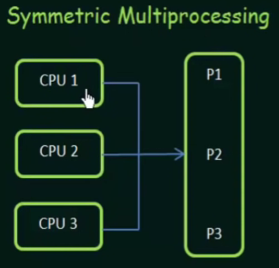 
  - All these CPUs and processors are actually the same.
  - They are similar to each other.
  - And they all participate in performing processes P1, P2, and P3 (task).
  - ==In other words, all the CPUs are involved in these tasks(P1, P2, P3).==

- **Asymmetric Multiprocessing**
  - 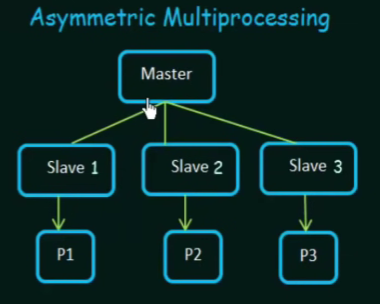 
  - Master-Slave approach
  - One of the CPU and one of the processor will act as a **==master==**.
  - And there are ==**slave processors**==.
  - The master processor monitors the slave processors, and assigns the task for the slave processors.
  - So the master processor is like the monitor which is guiding and supervising the slave processors.
  - And then ==the slave processors take care of particular processes.==
    - As you can see, the slave 1 processor is only taking care of the process P1.
  - 

### 4. Clustered Systems

- Like multiprocessor systems, clustered systems gather together multiple CPUs to accomplish computational work.

- The **difference** between Multiprocessor System and Clustered System is that ==they are composed of **two or more individual systems** coupled together.==

- It provides high availability.

- It can be structured asymmetrically or symmetrically.

  

- In **asymmetric**, one machine is in Hot-Standby mode, and the others run the applications. So the machine in Hot-Standby mode monitors the other systems which are running.

- In **symmetric**, two or more hosts run applications, and they monitor each other. So all the systems or all the hosts are running the application or involved in certain task.

- Symmetric clustered system can share and use all the resources more efficiently than asymmetric clustered system.
- 

# OS Structure 

## 1. Multiprogramming

- Multiprogramming means the capability of running multiple programs by the CPU.

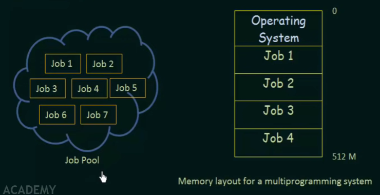 

- A job pool consists of all the jobs that entered the system.
- So, all the jobs that have to be executed are kept in a job pool.
- In this example, we are having 512 mega bytes of RAM. So, we're not able to load all of the jobs into the main memory. So a subset of the jobs( Job 1, Job 2,  Job 3, Job 4) are loaded into the main memory.
- The operating system has to help in executing the jobs loaded into the memory by assigning the CPU to these jobs.
- If we don't have multiprogramming, let's say Job 1 starts executing and it is using the CPU. until Job 1 finishes its executions completely, the other jobs( Job 2, Job 3, Job 4 ) can not use the CPU. So let's say that Job 1 was using the CPU and then it has to use resources in the course of its execution like the I/O devices. When Job 1 goes to use the I/O devices, the CPU is not used and it remains idle without being used by any other jobs. It is very inefficient way.

> A [computer processor](https://en.wikipedia.org/wiki/Computer_processor) is described as **idle** when it is not being used by any [program](https://en.wikipedia.org/wiki/Computer_program).
>
> https://en.wikipedia.org/wiki/Idle_(CPU)

- In multiprogramming, if Job 1 starts executing and it is using the CPU, and in the course of its execution, Job 1 tries to use the I/O devices.
- So, when it goes for using I/O devices or any other resources, the CPU is released from 'job 1' and then that CPU, instead of remaining idle,
  it can be used by another job, let' say 'jobs 2'.
- So, 'Job 2' can use the CPU, until 'Job1' finishes its other I/O devices operations and wants the CPU back. 
- So, 'job 2' will use the CPU.
- And, again if let's say 'job 2' wants to go for using some other resources and does not need the CPU at a particular time then instead of remaining idle, the CPU can be again used for 'Job 3' and so on.
- So, we can see that, the CPU does not remain idle.
- Whenever a particular job does not want to use the CPU, the CPU can be utilized by another job.
- So, this is a very efficient system or an efficient way of executing.

> 
>
> Multiprogrammed systems provide an environment in which the various system resources (for example, CPU, memory, and peripheral devices) are utilized effectively, but they do not provide for user interaction with the Computer system.
>
> 

## 2. Multitasking (Time Shared System)

- CPU executes multiple jobs by switching among them very frequently.
- So the user can interact with the program while it is running.
- 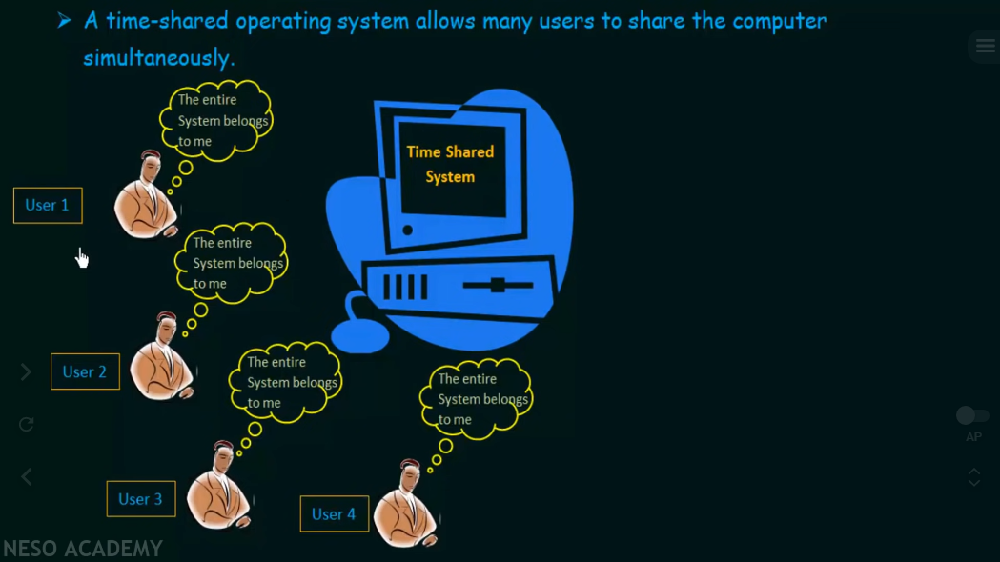 

- The users themselves don't realize that they are sharing the system.
- Because the switching between the jobs takes place so very quickly.
- The time shared system (multitasking) uses **==CPU scheduling==** and multiprogramming to provide each user with a small portion of time shared computer.
- A program loaded into memory and executing is called a "Process".

# OS Services

> Services provided by an OS

## 1. User Interface, UI

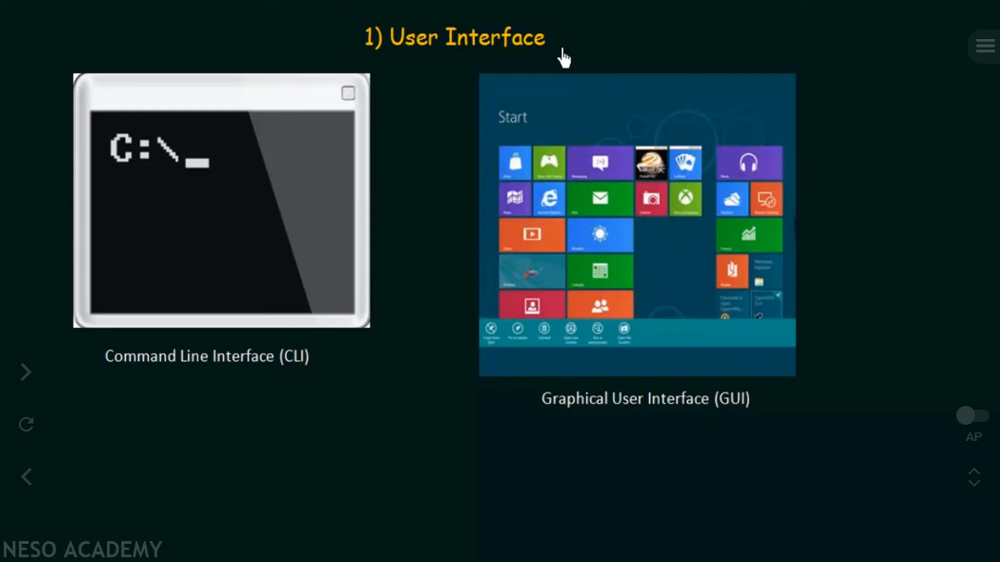 

- The user interface (UI) allows the user to interact with OS.
- So almost all operating systems have a user interface.

## 2. Program Execution

 

- The OS must provide for the execution of the programs.

## 3. I/O Operations

- Input Devices : Keyboard, Mouse ...

- Output Devices : Monitor, Speaker ... 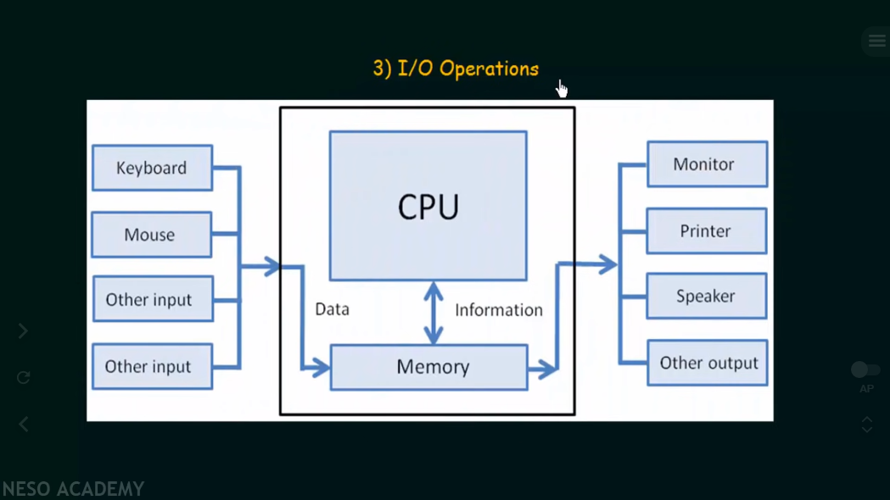 

- A running program that we have may require I/O, which may involves files or I/O devices.
- And these I/O operations should be provided by the OS.
- A user cannot directly control the I/O devices.
- ==When you are using your keyboards and mouse, you may feel like you are controlling it by yourself directly. But there is an operating system between you and your system, that actually controls usage of the I/O devices.==
- So this I/O operation is also one of the most important operations provided by the OS.

## 4. File System Manipulation (File System Management)

## 5. Communications

- Processes often need to communicate with each other.
- The process communication between the same computers, or even between the different computers, is controlled by the operating system.

## 6. Error detection

## 7. Resource Allocation

 

- Resources can be of different types. It may be the CPU, it may be the file, it may be the I/O devices,  it may be the main memory and so on.

- All the processes require certain resources at a certain point of time.
- So the OS must help in resource allocation.
- In other words, the OS should allocate the required resource to the processes which are waiting or asking for those resources.
- 

## 8. Accounting

Now we want to know which user use how much and what kind of resources. And why is this required? This record keeping may be used for accounting or simply for accumulating usage statistics. So, by keeping an account of this
or by having a statistics of this usage, it can be a valuable tool for researchers who wish to reconfigure the system or to improve the computing services.

## 9. Protection and Security

- **Protection**
  - When several different processes are executing at the same time, it should not be possible for one process to interfere with the others or with the operating system.
  - Protection involves ensuring that all access to system resources are controlled.

- **Security**
  - The system is not accessible to outsiders who are not allowed to access the system. 

# OS User Interface

- CLI
- GUI

# System Calls

- System calls provide an interface to the services made available by an OS.

## 1. User Mode & Kernel Mode

- User mode and kernel mode are two modes in which a program can execute.

- If a program is executing in user mode, then that program does not have direct access to the memory, the hardware and such resources.
- But if a program is executing in kernel mode, then that program has the direct access to the memory, the hardware, and such resources.
- When a program is executing in a kernel mode, if that program happens to crash during its execution then the entire system would crash or it comes to a halt.
- But it a program is executing in user mode, and if it crashes, then the entire system does not crash or the entire system does not come to a halt.
- So user mode is a safer mode of operation though kernel mode is the privileged mode.

## 2. System Call

- System call is a call that a program makes in order to access resources and go into the kernel mode.

- When a program is executing in user mode, it may needs access to some of the resources like memory, hardware and so on. So when the program needs access to these resources, it makes a call to the operating system telling that it needs access to certain resources.
- When it makes that call, the program is switched from user mode to kernel mode so that it can use those resources.
  - A Switching from user mode to kernel mode is known as context switching. (or from kernel mode to user mode)

- System call is the programmatic way in which a computer program requests a service from the kernel of the OS.
- These calls are generally available as routines written in C and C ++.
- When a program is executing in user mode and it needs to be switched to kernel mode for a particular time, this system call is meet

# Types of System calls

System calls can be grouped roughtly into five major categories :

1. Process Control
2. File Manipulation
3. Device Management
3. Information Maintenance
3. Communications

## 1. Process Control

- end, abort
- load, execute
- create process, terminate process
- get process attributes, set process attributes
- wait for time
- wait event, signal event
- allocate and free memory

## 2. File Manipulation

- create file, delete file
- open, close
- read, write, reposition
- get file attributes, set file attributes

## 3. Device Manipulation

- request device, realease device
- read, write, reposition
- get device attributes, set device attributes
- logically attach or detach devices

## 4. Information Maintenance

- get time or date, set time or date
- get system data, set system data
- get process, file, or device attributes
- set process, file, or device attributes

## 5. Communication

- create, delete communication connection
- send, receive messages
- transfer status information
- attach or detach remote devices

# System Programs

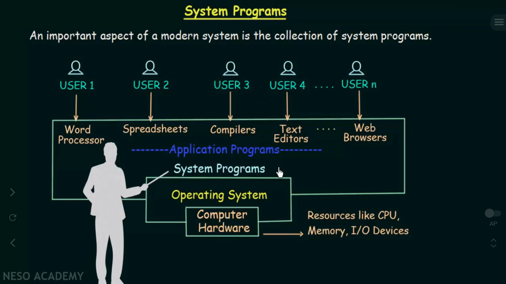 

- System programs provide a convenient environment for program development and execution.
- Some of them are simply user interfaces to system calls.
- Others are considerably more complex.

- System Programs can be divided into the following categories :
  1. File Management

## 1. File Management

- create, delete, copy, rename, print, dump and so on.

## 2. Status Information

## 3. File modification

## 4. Programming-language support

- Compilers, Assemblers, Debuggers and Interpreters for common programming languages (such as C, C++, Java, Visual Basic, and PERL) are often provided to the user with the operating system.

## 5. Program loading and execution

- Once a program is assembled or complied, it must be loaded into memory to be executed.
- The system may provide :
  - Absolute loaders
  - Relocatable loaders
  - Linkage editors and
  - Overlay loaders
- Debugging systems for either higher-level languages or machine language are needed as well.

## 6. Communications

- These programs provide the mechanism for :
  - Creating ==**virtual connections**== among processes, users, and computer systems.
  - Allowing users to send messages to one another's screens
  - To browse webpages
  - To send electronic-mail messages
  - To log in remotely or to transfer files from one machine to another.

 

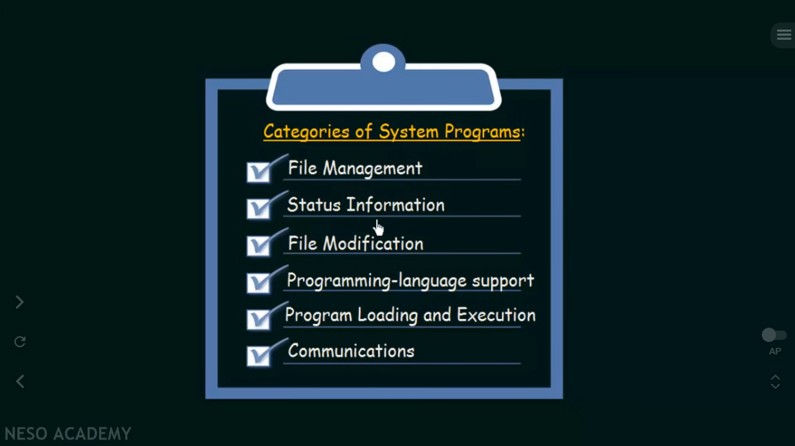 

# OS Design & Implementation

- Defining Goals and specification
  - Choice of Hardware
  - Type of System
- Beyond this highest design level, the requirements may be much harder to specify.

- Requirements :
  - User Goals
  - System Goals

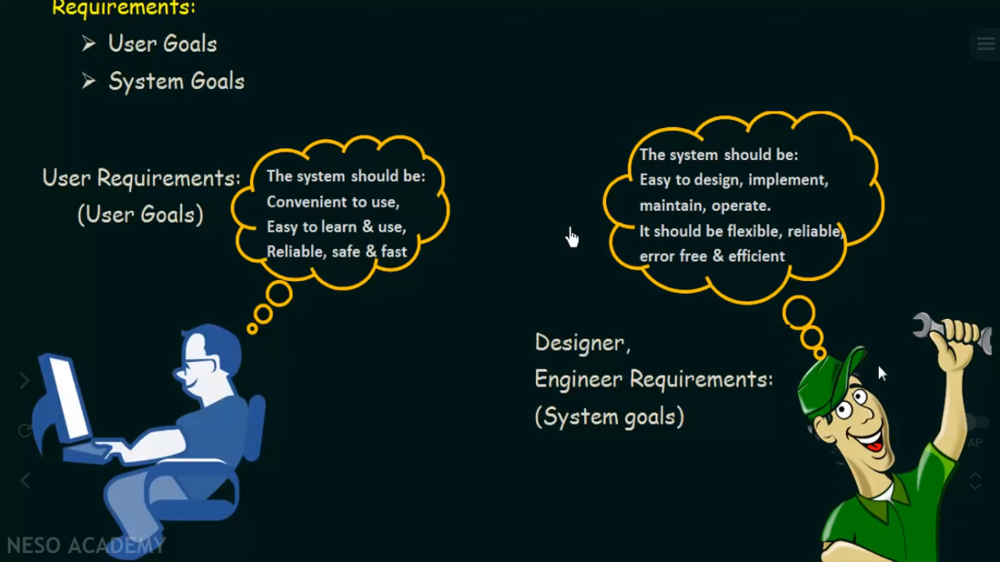 

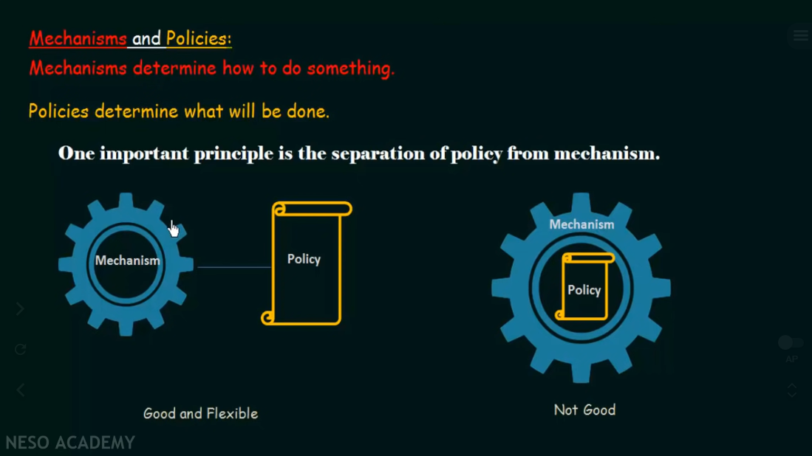

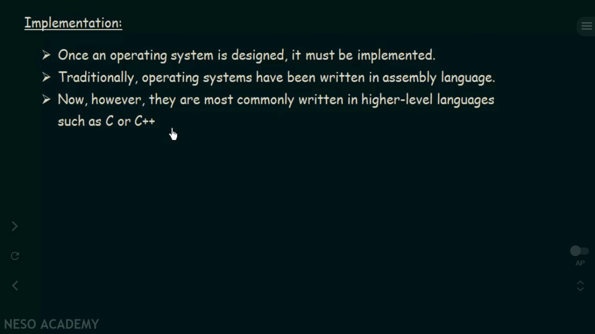

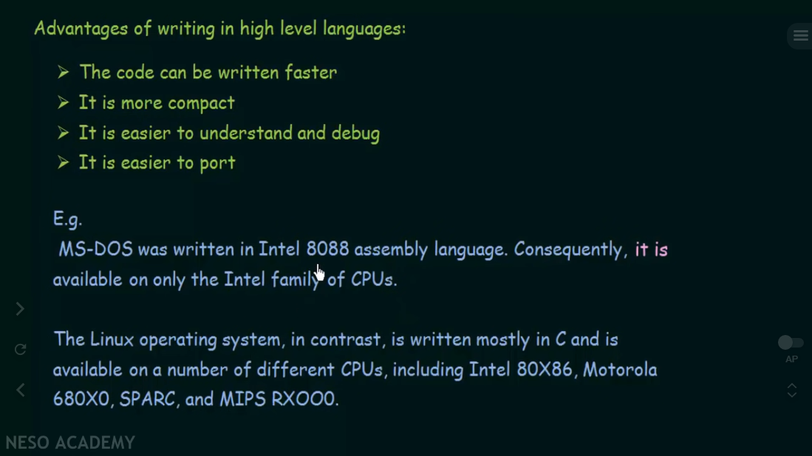

# Structures of OS

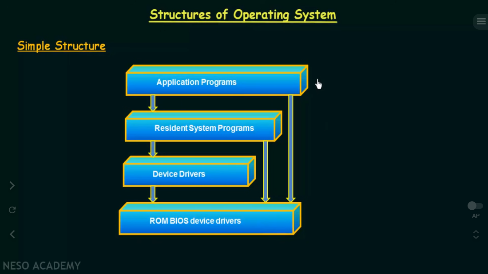 

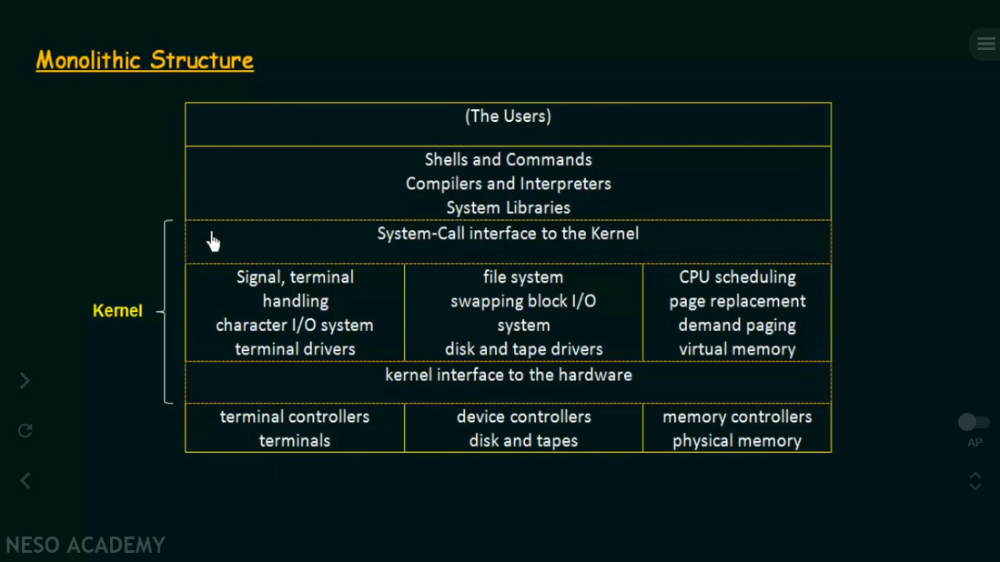

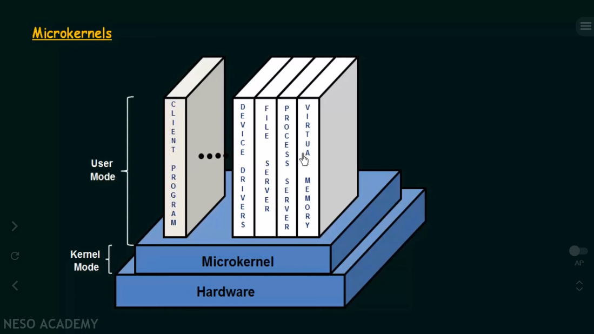  

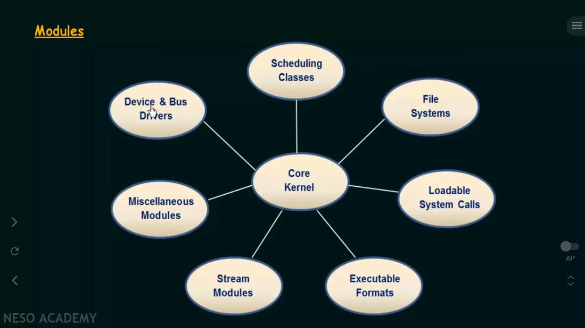

# Virtual Machines

The fundamental idea behind a virtual machine is to abstract the hardware of a single computer (the CPU, memory, disk drives, network interface cards, and so forth) into several different execution environments, thereby creating the illusion that each separate execution environment is running its own private computer.

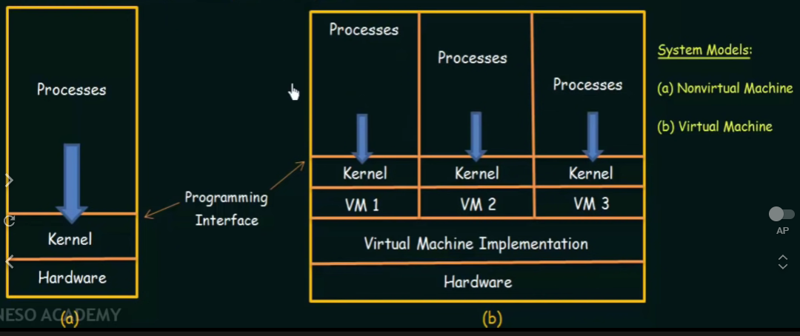 

- Virtual Machine Software runs in kernel mode.
- Virtual Machine itself runs in user mode.
- Consequently, we must have a virtual user mode and a virtual kernel mode both of which run in a physical user mode.
-  

# OS Generation & System Boot

 

 

